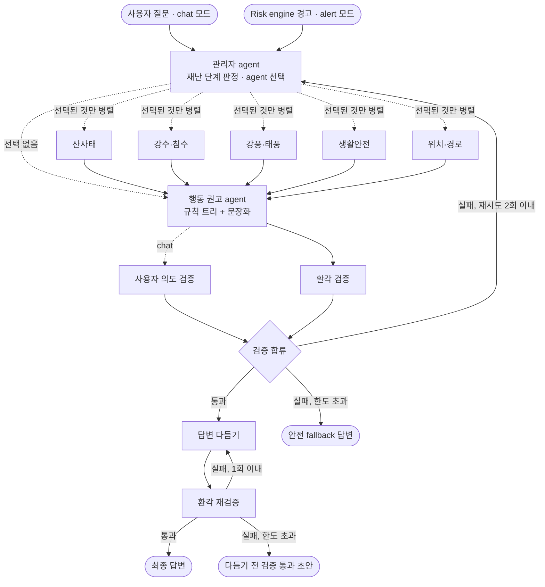
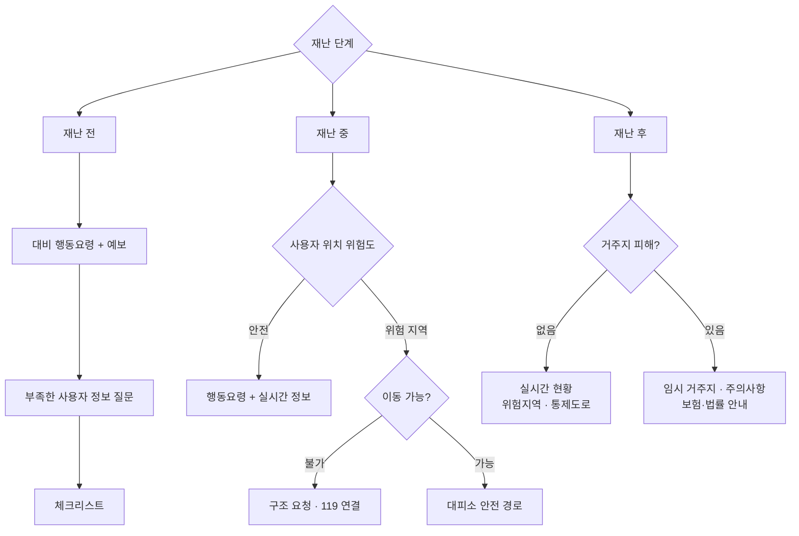

# 구룡가디언 agent 구조 설계 (B1)

기획서의 Multi-agent 구조를 LangGraph 그래프로 확정한 문서다. 노드·엣지·루프 한도는 `guardian_ai/graph.py`,
상태 스키마는 `guardian_ai/state.py`, DB 조회 tool은 `guardian_ai/tools.py`에 코드로 있다.
노드 본문은 아직 stub이며 B2(골격·관리자) → B3(침수·환각) → B4(재난 확장·행동 권고) → B5(의도·다듬기·음성) 순서로 채운다.

- LLM: Gemini 3.6 Flash / 오케스트레이터: LangGraph
- 테스트: `cd 코드/ai && .venv/bin/python -m pytest` (토폴로지·루프 한도 7건)

## 1. 그래프



기획서 구조와 다른 점 (의도적 변경):

| 변경 | 이유 |
| --- | --- |
| 의도 검증과 환각 검증을 **병렬** 실행 후 합류 | 둘 다 같은 초안을 보므로 결과는 같고 지연이 절반 |
| 루프 1 최대 2회, 루프 2 최대 1회 재시도 | 재난 상황에서 무한 루프·과도한 지연 방지 |
| 루프 1 한도 초과 시 fallback 답변 | 검증 못 한 답을 내보내지 않음 |
| 루프 2 한도 초과 시 다듬기 전 초안 반환 | 이미 검증된 내용이므로 형식만 포기 |
| alert 모드 추가 (의도 검증 생략) | 선제 경고(A5)를 같은 그래프로 생성. 사용자 질문이 없어 의도 검증 불필요 |
| 선택된 agent가 없으면 행동 권고로 직행 | 인사·일반 질문의 빠른 경로 |

## 2. 노드

| 노드 | 역할 | 읽는 state | 쓰는 state | tool | LLM |
| --- | --- | --- | --- | --- | --- |
| `manager` | 질문·경고 분석, 재난 단계 판정, 전문 agent 선택. 재시도 시 `manager_feedback` 반영 | question, risk_event, user, current_location, manager_feedback | phase, selected_agents, (specialist_results, checks 초기화) | get_risk_at, get_weather_warnings, get_user_profile | O (선택), 단계 판정은 규칙 |
| `landslide_agent` | 산사태 위험지역과 사용자 위치로 답변 조각 | user, current_location, phase | specialist_results | get_risk_at, get_hazard_zones, get_observations, get_weather_warnings | O |
| `rain_flood_agent` | 강수와 수위를 함께 고려한 호우·침수 답변 | 〃 | specialist_results | get_risk_at, get_observations, get_hazard_zones, get_weather_warnings, get_disaster_messages, get_facilities | O |
| `wind_typhoon_agent` | 강풍·태풍 답변 (선박 보유자는 계류 등 포함) | 〃 | specialist_results | get_risk_at, get_observations, get_weather_warnings, get_disaster_messages | O |
| `life_safety_agent` | 미세먼지·자외선 등급과 행동요령 | current_location | specialist_results | get_life_safety | O |
| `location_route_agent` | 위치 기반 경고, 대피소까지 안전 경로 | user, current_location | specialist_results (route 포함) | get_risk_at, get_facilities, request_route | O |
| `action_advisor` | 판단 트리로 행동 우선순위 결정 → 전문 agent 결과와 합쳐 초안 작성 | phase, specialist_results, user | action_plan, draft | get_action_guides, get_facilities | 문장화만 |
| `intent_check` | 초안이 질문 의도에 답하는지 (chat만) | question, history, draft | checks.intent | - | O |
| `hallucination_check` | 초안의 수치·사실이 evidence와 일치하는지 | draft, specialist_results[].evidence, action_plan | checks.hallucination | - | 숫자는 규칙 대조 + LLM |
| `verify_gate` | 검증 합류, 통과/재시도/fallback 결정 | checks, retry_count | verdict, retry_count, manager_feedback, verified_draft | - | X |
| `polish` | 수치는 표, 긴 글은 요약, 쉬운 문장 | verified_draft, polish_feedback | polished | - | O |
| `final_hallucination_check` | 다듬으며 내용이 바뀌지 않았는지 | polished, verified_draft, evidence | polish_verdict | - | 숫자는 규칙 대조 + LLM |
| `final_check_gate` | 루프 2 재시도 여부 | polish_verdict, polish_retry_count | polish_verdict, polish_retry_count | - | X |
| `finalize` | 최종 답변 확정 | polished 또는 verified_draft | final_answer | - | X |
| `fallback` | 검증 실패 시 최소 안내 (119, 대피소) | - | final_answer, used_fallback | - | X |

환각 검증의 전제: **모든 전문 agent는 답변에 쓴 수치를 `Evidence`로 남긴다.** evidence에 없는 수치가 초안에 있으면 실패.

## 3. 상태 (`GuardianState`)

| 그룹 | 필드 | 비고 |
| --- | --- | --- |
| 입력 | mode, user, current_location, question, risk_event, history | mode = `chat` 또는 `alert` |
| 관리자 | phase, selected_agents, manager_feedback | |
| 전문 → 권고 | specialist_results, action_plan, draft | specialist_results는 병렬 누적 reducer, 재시도 시 RESET |
| 루프 1 | checks, retry_count, verdict | checks는 병렬 병합 reducer |
| 루프 2 | verified_draft, polished, polish_feedback, polish_retry_count, polish_verdict | |
| 출력 | final_answer, used_fallback | |

도메인 모델: `UserProfile`, `Location`, `RiskEvent`, `Evidence`, `SpecialistResult`, `ActionPlan`, `CheckResult`, `ActionGuide`.
enum: `DisasterType`(7종), `Phase`(전·중·후·평시), `RiskLevel`(안전·주의·경보), `Specialist`, `Mobility`.

## 4. 행동 권고 판단 트리 (규칙, B4에서 구현)



재난 단계 판정 (관리자, 규칙):

| 단계 | 조건 |
| --- | --- |
| 전 | 예비특보(`status=planned`) 있음, 또는 예보상 기준 도달 예상 |
| 중 | 특보 발효(`active`) 또는 Risk engine이 사용자 위치 반경 내 `advisory` 이상 판정 |
| 후 | 특보 해제(`lifted`) 후 **N시간 이내** (N은 열린 질문) |
| 평시 | 위 조건 없음 |

"이동 가능"은 `UserProfile`(보행 장애, 휠체어, 동반자)과 경로 존재 여부로 판단. 정보가 없으면 질문한다.
행동 권고 agent는 `get_action_guides`로 가져온 원문만 인용하고, 인용한 id를 `ActionPlan.guide_ids`에 남긴다.

## 5. DB 조회 tool 명세 — A와 합의 필요

반환 예시는 `guardian_ai/tools.py`의 목업. A1 API 명세와 대조 후 키 이름을 맞춘다.
공통: 좌표 WGS84, 시간 ISO 8601(+09:00), 모든 응답에 `source` 포함(evidence용).

| tool | 인자 | 반환 핵심 키 | 테이블/출처 | 합의 |
| --- | --- | --- | --- | --- |
| `get_risk_at` | lat, lon, radius_m | disaster, level, distance_m, reason, assessed_at | risk_assessments (Risk engine) | [ ] |
| `get_observations` | kind(rain·wind·water_level·wave·tide), lat, lon | value, unit, station, observed_at | observations (디지털 트윈, 기상청) | [ ] |
| `get_weather_warnings` | region | type, level, status(planned·active·lifted), issued_at, lifted_at | weather_warnings (기상청) | [ ] |
| `get_disaster_messages` | region, hours | sent_at, sender, text | disaster_messages (재난안전24) | [ ] |
| `get_hazard_zones` | kind(landslide·flood), lat, lon, radius_m | zone_id, grade, contains_point, distance_m | hazard_zones (PostGIS) | [ ] |
| `get_facilities` | kind(shelter·medical·manhole), lat, lon, limit | name, lat, lon, distance_m, phone | facilities | [ ] |
| `get_life_safety` | lat, lon | pm10, pm25, uv 각 value·grade | observations | [ ] |
| `get_user_profile` | user_id | UserProfile 키 | users | [ ] |
| `request_route` | origin, destination, profile(adult·elderly·wheelchair) | distance_m, duration_s, avoided, geometry | GraphHopper (/route, B6·B7) | [ ] |
| `get_action_guides` | disaster, phase, audience | id, text, source_name, source_url | action_guides | [ ] |

조회 방식 제안: AI 프로세스가 **PostgreSQL을 직접 읽기 전용으로 조회**(읽기 전용 계정). FastAPI를 거치지 않아 지연이 줄고, 쓰기는 A의 수집 프로세스만 한다. 경로만 GraphHopper HTTP 호출.

## 6. 행동요령 데이터 형식 (`ActionGuide`)

원문 수집은 별도 작업. 저장 형식만 확정한다.

```json
{
  "id": "flood.during.elderly.01",
  "disaster": "flood",
  "phase": "during",
  "audience": "elderly",
  "text": "(원문 그대로)",
  "source_name": "포항시 재난안전",
  "source_url": "https://...",
  "retrieved_at": "2026-09-24T10:00:00+09:00"
}
```

- `disaster`: landslide, heavy_rain, flood, strong_wind, typhoon, fine_dust, uv
- `phase`: before, during, after
- `audience`: general, elderly, disabled, tourist, fisher
- id 규칙: `{disaster}.{phase}.{audience}.{순번}`

## 7. 열린 질문

1. 재난 '후' 판정 기간 N시간 (예: 특보 해제 후 24시간)?
2. 맨홀 위치 데이터를 포항 디지털 트윈이 제공하는가? (A7과 동일 질문)
3. AI의 DB 직접 조회(읽기 전용) vs FastAPI 경유 — A와 결정
4. 한 질문당 LLM 호출이 최소 5회. 음성 대화에서 지연이 크면 alert 모드처럼 의도 검증 생략, 또는 단순 질문은 다듬기 생략 검토 (B5에서 측정 후 결정)
5. 대화 중 알게 된 사용자 정보(예: "다리가 불편해요")를 `users`에 저장하는 주체 — 관리자 agent가 tool로 쓰기? A와 결정
