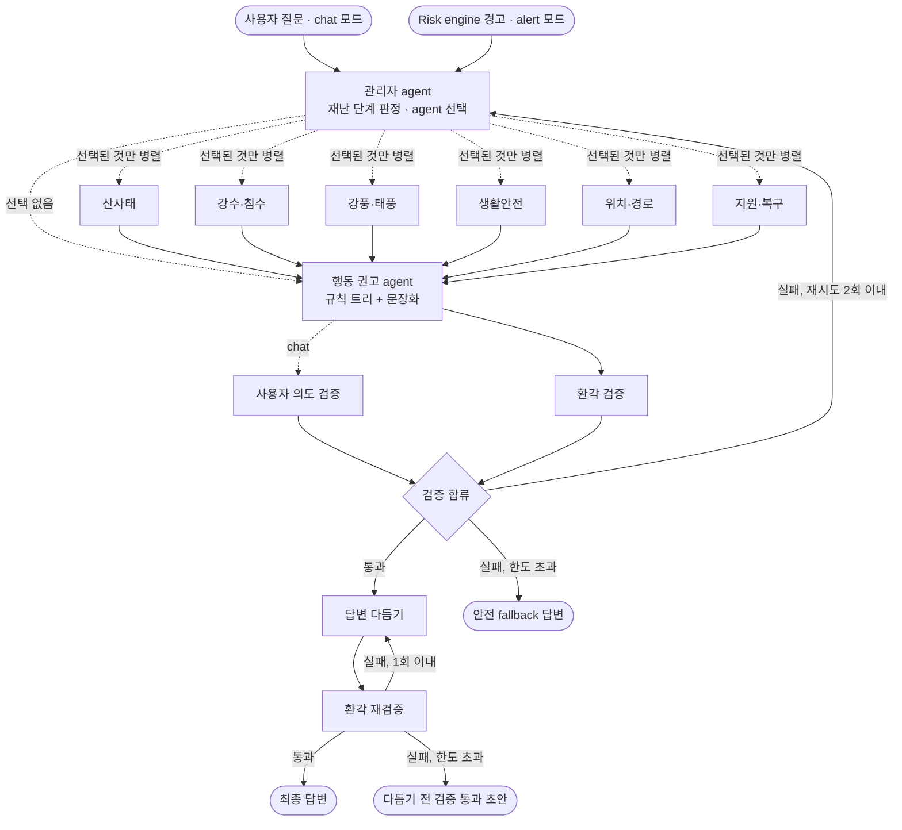
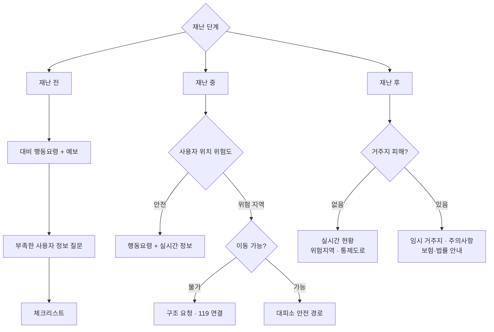

# 구룡가디언 agent 구조 설계 (B1)

기획서의 Multi-agent 구조를 LangGraph 그래프로 확정한 문서다. 노드·엣지·루프 한도는 `guardian_ai/graph.py`,
상태 스키마는 `guardian_ai/state.py`, DB 조회 tool은 `guardian_ai/tools.py`에 코드로 있다.
노드 본문은 아직 stub이며 B2(골격·관리자) → B3(침수·환각) → B4(재난 확장·행동 권고) → B5(의도·다듬기·음성) 순서로 채운다.

- LLM: OpenAI gpt-6-luna (2026-10-01 Gemini에서 전환, 가성비 기준) / 오케스트레이터: LangGraph
- 테스트: `cd 코드/ai && .venv/bin/python -m pytest` (토폴로지·루프 한도 7건)

## 1. 그래프


```mermaid
flowchart TD
    IN([사용자 질문 · chat 모드]) --> M
    EV([Risk engine 경고 · alert 모드]) --> M
    M[관리자 agent<br/>재난 단계 판정 · agent 선택]
    M -. 선택된 것만 병렬 .-> L[산사태] & R[강수·침수] & W[강풍·태풍] & S[생활안전] & P[위치·경로] & RS[지원·복구]
    M -. 선택 없음 .-> A
    L & R & W & S & P & RS --> A[행동 권고 agent<br/>규칙 트리 + 문장화]
    A -. chat .-> I[사용자 의도 검증]
    A --> H[환각 검증]
    I & H --> G{검증 합류}
    G -- 통과 --> PO[답변 다듬기]
    G -- 실패, 재시도 2회 이내 --> M
    G -- 실패, 한도 초과 --> FB([안전 fallback 답변])
    PO --> H2[환각 재검증]
    H2 -- 통과 --> OUT([최종 답변])
    H2 -- 실패, 1회 이내 --> PO
    H2 -- 실패, 한도 초과 --> OUT2([다듬기 전 검증 통과 초안])
```

기획서 구조와 다른 점 (의도적 변경):

| 변경 | 이유 |
| --- | --- |
| 의도 검증과 환각 검증을 **병렬** 실행 후 합류 | 둘 다 같은 초안을 보므로 결과는 같고 지연이 절반 |
| 루프 1 최대 2회, 루프 2 최대 1회 재시도 | 재난 상황에서 무한 루프·과도한 지연 방지 |
| 루프 1 한도 초과 시 fallback 답변 | 검증 못 한 답을 내보내지 않음 |
| 루프 2 한도 초과 시 다듬기 전 초안 반환 | 이미 검증된 내용이므로 형식만 포기 |
| alert 모드 추가 (의도 검증 생략) | 선제 경고(A5)를 같은 그래프로 생성. 사용자 질문이 없어 의도 검증 불필요 |
| 선택된 agent가 없으면 행동 권고로 직행 | 인사·일반 질문의 빠른 경로 |

## 2. 노드

| 노드 | 역할 | 읽는 state | 쓰는 state | tool | LLM |
| --- | --- | --- | --- | --- | --- |
| `manager` | 질문·경고 분석, 재난 단계 판정, 전문 agent 선택. 재시도 시 `manager_feedback` 반영 | question, risk_event, user, current_location, manager_feedback | phase, selected_agents, (specialist_results, checks 초기화) | get_risk_at, get_weather_warnings, get_user_profile | O (선택), 단계 판정은 규칙 |
| `landslide_agent` | 산사태 위험지역과 사용자 위치로 답변 조각 | user, current_location, phase | specialist_results | get_risk_at, get_hazard_zones, get_observations, get_weather_warnings | O |
| `rain_flood_agent` | 강수와 수위를 함께 고려한 호우·침수 답변 | 〃 | specialist_results | get_risk_at, get_observations, get_hazard_zones, get_weather_warnings, get_disaster_messages, get_facilities | O |
| `wind_typhoon_agent` | 강풍·태풍 답변 (선박 보유자는 계류 등 포함) | 〃 | specialist_results | get_risk_at, get_observations, get_weather_warnings, get_disaster_messages | O |
| `life_safety_agent` | 미세먼지·자외선 등급 (행동요령은 행동 권고가 원문으로) | current_location | specialist_results | get_life_safety | O |
| `location_route_agent` | 위치 기반 경고, 대피소까지 안전 경로 (바다 위면 항구 경유) | user, current_location | specialist_results (route 포함) | get_risk_at, get_facilities, request_route, request_sea_route | O |
| `recovery_support_agent` | 보험·피해 신고·복구 지원 제도를 [공통 보험]·[공통 피해 신고·복구]·[내 직업 지원·복구]로 안내 (2026-10-08, `recovery.py`). 직업 = 서버 프로필, 질문에 재난이 있으면 그 재난 제도만, DB에 없으면 "등록된 제도 없음" | question, user | specialist_results | get_support_programs | O |
| `action_advisor` | 판단 트리로 행동 우선순위 결정 → 전문 agent 결과와 합쳐 초안 작성 | phase, specialist_results, user | action_plan, draft | get_action_guides, get_facilities | 문장화만 |
| `intent_check` | 초안이 질문 의도에 답하는지 (chat만). 실제 서비스는 아래 `hallucination_check`와 한 번의 LLM 호출로 함께 (B5) | question, history, draft | checks.intent | - | O |
| `hallucination_check` | 초안의 수치·사실이 evidence와 일치하는지 | draft, specialist_results[].evidence, action_plan | checks.hallucination | - | 숫자는 규칙 대조 + LLM |
| `verify_gate` | 검증 합류, 통과/재시도/fallback 결정 | checks, retry_count | verdict, retry_count, manager_feedback, verified_draft | - | X |
| `polish` | 카드형 필드(코드) + 600자 넘는 답만 쉬운 말 요약 + 음성용 문장 | verified_draft, polish_feedback | polished, voice_text, card | - | 긴 답만 O |
| `final_hallucination_check` | 다듬은 글·음성 문장의 숫자가 근거와 맞는지 | polished, voice_text, evidence | polish_verdict, polish_feedback | - | X (규칙만) |
| `final_check_gate` | 루프 2 재시도 여부 | polish_verdict, polish_retry_count | polish_verdict, polish_retry_count | - | X |
| `finalize` | 최종 답변 확정 | polished 또는 verified_draft | final_answer | - | X |
| `fallback` | 검증 실패 시 최소 안내 (119, 대피소) | - | final_answer, used_fallback | - | X |

환각 검증의 전제: **모든 전문 agent는 답변에 쓴 수치를 `Evidence`로 남긴다.** evidence에 없는 수치가 초안에 있으면 실패.

B3 구현 (2026-10-01):
- `rain_flood_agent` (`flood.py`): ① 코드가 DB에서 위험 판정·수위·강수·특보·재난문자(주의 이상이면 대피소)를 모으고
  ② 코드가 근거(Evidence)를 만들고 ③ LLM(`OpenAIWriter`)은 근거만 보고 2~4문장을 쓴다. 위험 단계는 A의 판정 엔진 값을
  그대로 쓴다. LLM이 실패하면 근거 숫자를 그대로 넣은 템플릿 문장. 위치는 현재 위치 → 집 → 구룡포읍 중심(밝힘).
  DB가 안 되면 "확인할 수 없음"을 밝히고 "안전하다"고 단정하지 않는다. 재시도 때는 `manager_feedback`을 작성기에 넘긴다.
- `hallucination_check` (`verify.py`): ① 숫자 검사(규칙) — 초안의 측정값(mm·cm·m·m/s·%·℃ 등)이 근거와 반올림 오차
  안에서 맞는지, 단위 변환 허용 ② 내용 검사(LLM, `OpenAIFactChecker`, 추론 medium) — 특보·위험 단계·근거 없는 사실·
  관측소 바꿔치기. ①에서 걸리면 ②는 부르지 않는다. ②가 장애면 ①의 결과로 판단. 모델은 `OPENAI_VERIFY_MODEL`로 따로 올릴 수 있다.
- 검증 결과 (gpt-6-luna, 2회 반복): 틀린 답 10/10 걸러짐, 맞는 답 3/3 통과 (`tests/test_verify_live.py`).
- 관측값은 시연용 모의값을 6시간 동안 실측보다 우선한다 (A 판정 엔진과 같은 규칙 — 판정과 근거 수치가 어긋나지 않게).

관리자 agent 동작 (B2 구현):
- chat 모드: LLM(OpenAI)이 질문·최근 대화·사용자 프로필(재시도면 실패 사유 포함)을 보고 전문 agent를 고른다 (`llm.py` `OpenAIClassifier`).
  LLM이 실패하거나 10초 안에 답하지 않으면 **키워드 분류로 대체**한다. 재난 중 AI 장애로 답이 끊기지 않게 하기 위함.
- alert 모드: LLM 없이 규칙으로 고른다. 산사태→산사태, 호우·침수→강수·침수, 강풍·태풍→강풍·태풍, 미세먼지·자외선→생활안전.
  위치·경로 agent는 경보(WARNING) 단계이면서 대피가 필요한 재난(산사태·호우·침수·강풍·태풍)일 때만 붙는다.
- 새 질문이 들어오면 이전 질문의 재시도 횟수·실패 사유를 초기화한다. 검증 실패로 되돌아온 경우(`verdict == "retry"`)만 이어 간다.
- 재난 단계(phase) 판정은 아직 stub(항상 '재난 중'). B4에서 특보·위험 판정 규칙으로 구현.

## 3. 상태 (`GuardianState`)

| 그룹 | 필드 | 비고 |
| --- | --- | --- |
| 입력 | mode, user, current_location, question, risk_event, history, user_memory | mode = `chat` 또는 `alert`, user_memory = 사용자 기억 문장 (아래 기억 절) |
| 관리자 | phase, selected_agents, manager_feedback | |
| 전문 → 권고 | specialist_results, action_plan, draft | specialist_results는 병렬 누적 reducer, 재시도 시 RESET |
| 루프 1 | checks, retry_count, verdict | checks는 병렬 병합 reducer |
| 루프 2 | verified_draft, polished, polish_feedback, polish_retry_count, polish_verdict | |
| 출력 | final_answer, used_fallback | |

도메인 모델: `UserProfile`, `Location`, `RiskEvent`, `Evidence`, `SpecialistResult`, `ActionPlan`, `CheckResult`, `ActionGuide`.
enum: `DisasterType`(9종, DB hazard_type과 같음), `Phase`(전·중·후·평시), `RiskLevel`(DB와 같은 5단계 normal·watch·advisory·warning·critical), `Specialist`, `Mobility`.

## 4. 행동 권고 판단 트리 (규칙, B4에서 구현)


```mermaid
flowchart TD
    P{재난 단계} --> B[재난 전]
    P --> D[재난 중]
    P --> F[재난 후]
    B --> B1[대비 행동요령 + 예보] --> B2[부족한 사용자 정보 질문] --> B3[체크리스트]
    D --> D0{사용자 위치 위험도}
    D0 -- 안전 --> D1[행동요령 + 실시간 정보]
    D0 -- 위험 지역 --> D2{이동 가능?}
    D2 -- 불가 --> D3[구조 요청 · 119 연결]
    D2 -- 가능 --> D4[대피소 안전 경로]
    F --> F0{거주지 피해?}
    F0 -- 없음 --> F1[실시간 현황<br/>위험지역 · 통제도로]
    F0 -- 있음 --> F2[임시 거주지 · 주의사항<br/>보험·법률 안내]
```

재난 단계 판정 (관리자, 규칙):

| 단계 | 조건 |
| --- | --- |
| 전 | 예비특보(`status=planned`) 있음, 또는 예보상 기준 도달 예상 |
| 중 | 특보 발효(`active`) 또는 Risk engine이 사용자 위치 반경 내 `advisory` 이상 판정 |
| 후 | 특보 해제(`lifted`) 후 **24시간 이내** (2026-10-03 결정, `action.LIFTED_HOURS`) |
| 평시 | 위 조건 없음 |

"이동 가능"은 `UserProfile`(보행 장애, 휠체어, 동반자)과 경로 존재 여부로 판단. 정보가 없으면 질문한다.
행동 권고 agent는 `get_action_guides`로 가져온 원문만 인용하고, 인용한 id를 `ActionPlan.guide_ids`에 남긴다.

판단 로직 (사용자 정의, 2026-10-03 — `action.decide`가 코드로 따라간다):
- 재난 전·평시(대비): 대비 행동요령 + 예보(`get_forecast`) → 동반자 정보가 없으면 "함께 대피해야 할 가족이 있나요?" → 있으면 체크리스트
- 재난 중: 사용자 위치가 발효 중인 침수·산사태 영역(주의 이상) 안인가(`hazards_at`, 판정 불가·위치 모름 → 위험 지역)
  - 안전: 재난 중 행동요령 + 실시간 정보
  - 위험 지역: 이동 가능? 분류기의 `can_move`(대화) → 모르면 프로필(보행 불편·휠체어·75세 이상·동반자면 질문, 아니면 가능)
    - 불가능: 119 구조 요청을 답변 맨 앞 + `call_emergency` / 가능: 가장 가까운 안전한 대피소 경로(위치·경로 agent 결과 또는 직접 계산)
    - 모름: 안내(경로 포함) + "지금 스스로 안전한 곳까지 이동하실 수 있나요?"
- 재난 후: 재난 후 행동요령 → 분류기의 `damage`(대화) → 모름: 질문 / 없음: 실시간 현황 / 있음: 현황·임시 거주·주의사항·보험·법률
  (통제 도로·보험·법률은 데이터가 없어 "확인되지 않음")
- 평시에 정보만 묻는 질문("내일 비 와?")은 행동 권고·질문을 붙이지 않는다.
- 응답: `decision_path`("재난 중 > 위험 지역 > 이동 가능"), `follow_up`(질문), `call_emergency`, `route`. 사용자가 답하면 다음 질문에서
  분류기가 대화로 `can_move`·`damage`를 판정해 다음 분기로 간다.

구현 (B4, 2026-10-03, `action.py`):
- 단계 판정 `decide_phase`: 위 표 그대로. DB 장애면 '중'. 관리자가 `phase_of`로 부른다(기본 그래프·테스트는 '중' 고정).
- 원문 고르기(규칙): 단계가 가장 높은 전문 agent(같으면 침수·호우 > 강풍·태풍 > 산사태 > 생활안전, 위치·경로 제외)의 재난들
  (침수 agent → flood·heavy_rain, 강풍·태풍 → typhoon·strong_wind·high_seas)에서 단계·대상(주민/관광객 + 직업: 어업 →
  fisher·vessel_owner·coastal, 차량 → driver)에 맞는 원문 최대 3건. 직업 대상 원문을 앞에(관광객·주민 대상 원문은 장소별이라 앞에 두지 않음).
  평시 질문("태풍 오면 어떻게 해?")은 '재난 전' 원문 → 없으면 '관심' 단계 '재난 중' 원문.
- 119(D3): 위험 단계 경보 이상 + 보행 불편·휠체어 + (경로 없음 또는 위험 영역을 지나야 함) → `call_emergency`, 첫 할 일로 구조 요청.
- 작성: `OpenAIActionWriter`가 원문만 바탕으로 사용자 상황에 맞춘 '지금 할 일' 2~4개. 실패하면 원문 그대로 번호 목록.
  인용 원문은 `ActionPlan.evidence`로 환각 검증에 들어가고, 내용 검사는 원문에 없는 행동 지시를 실패로 본다.
- 생활안전 행동요령 원문은 아직 DB에 없다(A 요청) → 자외선·미세먼지 질문은 수치·등급만 답하고 '지금 할 일'은 붙지 않는다.

## 5. DB 조회 tool 명세 — 직접 조회 (B3, 2026-10-01 결정)

**조회 방식**: AI 프로세스가 PostgreSQL을 **읽기 전용 계정으로 직접 조회**한다 (기획서 "데이터베이스와 AI agent를 연결").
A의 FastAPI는 앱·웹이 부르는 창구로 남고, AI는 거치지 않는다. 쓰기는 A의 수집기·판정 엔진만 한다.
- 계정: `db/init/07_ai_readonly.sh`가 만든 `AI_DB_USER`(기본 guardian_ai) — public 스키마 SELECT만, 계정 기본값과
  접속 옵션 두 겹으로 읽기 전용 트랜잭션, 조회 3초 제한. 이미 만든 DB에는 스크립트를 한 번 직접 실행한다.
- 코드: `guardian_ai/db.py`(커넥션 풀, 첫 조회 때 연결), `guardian_ai/tools.py`(SQL과 결과 변환).
- A와의 약속: AI가 아래 표·뷰를 읽는다. **컬럼 이름이나 의미를 바꿀 때는 B에게 알린다.**

공통: 반환은 dict `{"available": True, ..., "source": <테이블>}`, 실패하면 예외 대신 `{"available": False, "reason"}`.
좌표 WGS84, 시간 ISO 8601(+09:00), 거리 m 정수. 위험 단계는 DB와 같은 5단계 `normal < watch < advisory < warning < critical`.

| tool | 인자 | 반환 핵심 키 (`items[]`) | 읽는 표 |
| --- | --- | --- | --- |
| `get_risk_at` | lat, lon, radius_m=500 | max_level, data_stale(판정 30분 이상 멈춤), items: hazard, level, label, reason(엔진 근거 문장), metric·value·unit, distance_m, observed_at, simulated | risk_assessments, ingest_runs |
| `get_observations` | kind(water_level·rain·wind·uv·air), lat, lon | station, metric, value, unit, level_label(포항 DT 등급), observed_at, distance_m, stale(2시간) | v_latest_observations |
| `get_weather_warnings` | lifted_hours=24 | hazard, level, region, headline, status(planned·active·lifted), issued_at, lifted_at | weather_warnings |
| `get_disaster_messages` | hours=6 | sent_at, sender, category, hazard, alert_class, text | disaster_messages (재난안전24 키 받기 전 비어 있음) |
| `get_hazard_zones` | lat, lon, radius_m, kind=landslide | zone_id, name, grade, contains_point, distance_m | hazard_zones (산사태 488곳, 침수 구역은 A가 삭제) |
| `get_facilities` | kind(shelter·medical·manhole), lat, lon, limit, shelter_type | facility_id, name, lat, lon, distance_m + 종류별(대피소 종류·수용인원, 응급실 직통) | shelters, medical_facilities, manholes |
| `get_life_safety` | lat, lon | uv·pm10·pm25 각 value·grade (미세먼지는 수집 권한 전까지 None) | v_latest_observations |
| `get_action_guides` | disaster, phase, level, targets | `ActionGuide`와 같은 키: id, min_level, targets, priority, title, content, voice_text, source_name | action_guides (51건) |
| `get_user_profile` | 로그인 uid (Firebase) | {available, profile: UserProfile 키 중 서버에 있는 것} | **실제** (2026-10-08) — `users`·`user_profiles`·`user_places` (앱 프로필 화면과 AI(`profile_sync.py`)가 함께 고치는 한 곳). 채팅에서 로그인 토큰 uid = user_id 일 때 기준, 앱이 보낸 값은 빈 칸만 보충 (6-1절) |
| `get_support_programs` | hazard=None | category(insurance·recovery·livelihood·legal·medical·fishery), hazards, targets(all·resident·fisher·farmer), name, summary, eligibility, how_to_apply, apply_period, department, contact, url | support_programs (9건, 서버 `/api/v1/support-programs`와 같은 SQL) |
| `get_forecast` | lat, lon, hours=48 | periods(날짜별 최고 강수확률·강수형태·비 시간 수·1시간 최대 강수량·최대 풍속·파고), next_rain | v_latest_forecasts (기상청 초단기·단기, 구룡포 격자 2곳) |
| `get_safe_shelters` | lat, lon, limit=8 | name, lat, lon, distance_m, is_indoor, underground, safe, excluded_reason(위험 영역 안·침수 중 지하) | shelters, risk_assessments (앱과 같은 규칙) |
| `find_place` | query, user | available, name, lat, lon, kind(home·work·place·shelter·medical), source(user·db·kakao), address, out_of_area | profile 등록 장소, shelters·medical_facilities, 카카오 로컬 키워드 검색 |
| `hazards_at` | lat, lon | labels(지점이 들어 있는 침수·산사태 영역, 주의 이상) | risk_assessments |
| `request_route` | origin, destination, profile(adult·elderly) | available, distance_m, duration_s, ascend_m, descend_m, max_slope_pct, avoided, still_inside, hazards_ok, geometry | route 서비스 HTTP (B6·B7). 회피: 판정 엔진의 침수·산사태 영역(주의 이상), 맨홀 없음 |
| `request_sea_route` | origin, destination(생략 가능), profile | available, at_sea, port{name, berth, land_point}, sea_leg{distance_m, straight_m, bearing_label, path, path_found, alternatives}, destination, land_route, land_route_error | route 서비스 HTTP `/api/route/sea` (B11, 2026-10-07). 위치·경로 agent가 경로를 낼 때 먼저 부른다 — 육지면 land_route = 일반 경로, 바다 위면 항구 기준으로 대피소를 다시 고른다. 422(범위 밖)·장애는 `request_route`로 대신 |

**시연 모드 (2026-10-07, `guardian_ai/demo.py`)**: `ChatRequest.demo=true`면 위 tool이 실시간 표(`risk_assessments`,
`observations`, `weather_warnings`, `disaster_messages`, `v_latest_forecasts`, `ingest_runs`)를 같은 이름의 WITH 절로 가린 SQL을 보낸다.
WITH 절은 api `/api/v1/demo/*`(server/risk/demo.py — 실제 센서 위치 + 시연 측정값, DB 저장 안 함)로 채운다. SQL·판단 규칙은 그대로,
고정 자료(대피소·산사태 취약지역·행동요령)는 실제 표. 경로 tool은 `demo: true`를 붙인다. 시연 데이터를 못 받으면 실측으로 바꾸지 않고
`available: False`. 시연 대화에서 들은 사용자 정보도 프로필에 반영한다 (2026-10-08).

데이터에서 알게 된 것 (2026-10-01): 구룡포 대피소 19곳은 지진해일(17)·민방위(2)만 지정, **침수 지정 대피소 없음** →
침수 안내는 `shelter_type=None`으로 가까운 대피소를 쓴다. 의료시설 5곳은 포항 시내 응급실(구룡포에서 약 20km).
조위·파고는 아직 수집하지 않는다.

## 6. 행동요령 데이터 형식 (`ActionGuide`)

A7이 `action_guides` 표에 적재한 형식을 그대로 쓴다 (2026-10-01, 이전 문자열 id·audience 안을 대체).

```json
{"id": 1, "disaster": "heavy_rain", "phase": "during", "min_level": "advisory", "targets": ["all"], "priority": 10,
 "title": "호우가 시작되면", "content": "(원문 그대로)", "voice_text": "(음성용 짧은 문장)",
 "source_name": "포항시 재난안전 홈페이지", "source_url": null}
```

- `phase`: before, during, after / `min_level`: 이 단계 이상일 때만 보여 준다
- `targets`: all, resident, tourist, fisher, vessel_owner, coastal, farmer, driver (`all`은 항상 포함해 조회)
- `priority`: 낮을수록 먼저. 행동 권고 agent는 이 문장만 인용한다

## 6-1. 기억과 사용자 프로필 (2026-10-08 개정)

- **단기 기억 (대화 안)**: Checkpointer — `InMemorySaver` (서버 메모리), thread_id = conversation_id. 그래프 상태 전체.
  마지막 문답 후 1시간(`CONVERSATION_TTL_MIN`) 또는 서버 재시작까지 — 지나면 지우고 새 대화로 시작. 위치·건강 정보가 대화 상태째로
  영구 저장되지 않게 DB에 두지 않는다 (사용자 결정 2026-10-02).
- **사용자 정보 (대화를 넘어) = 서버 프로필 하나** (사용자 결정 2026-10-08): `user_profiles`·`user_places` (lane A 표).
  - 읽기: 로그인 토큰 uid = 요청 user_id 일 때 질문마다 `tools.get_user_profile` (읽기 전용 계정). 앱이 함께 보낸 값은 서버에 없는 칸만 보충.
  - 쓰기: 응답 뒤 백그라운드에서 `OpenAIMemoryExtractor`가 이번 문답에서 사용자가 자기에 대해 말한 것(나이·
    이동수단·직업·시각·청각·집 주소·자주 가는 곳)을 뽑고 (보행 능력·보호가 필요한 동반자는 2026-10-09부터 뽑지도, 서버에서 읽지도 않음 —
    이번 질문에서 "다리를 다쳤다"처럼 말한 그때의 상황은 그 대화 안에서만 씀), `profile_sync.ProfileWriter`가 **사용자 본인 토큰으로** 서버 API
    (`POST /api/v1/user`, `/api/v1/user/places`)를 불러 바로 고친다 — AI에 DB 쓰기 권한 없음, 앱 프로필 화면과 같은 검증 규칙.
    프로필 값과 다르면 덮어쓴다(가장 최근에 말한 것·고친 것이 이긴다). 장소는 좌표를 찾은 것만 (카카오, 구룡포 일대).
  - 수집 기록: 반영한 것은 `POST /api/v1/user/profile-updates`로 한 줄씩(칸·값·사용자가 한 말·시각) `care.profile_updates`에
    남긴다 (사용자 발언에 건강 정보가 섞일 수 있어 care 스키마 — AI 읽기 전용 계정은 못 읽음). 앱 프로필 화면
    'AI가 대화에서 수집한 정보'가 `GET`으로 보여 주고, 지우면 기록만 지운다(프로필 값은 그대로).
  - 앱 프로필 화면도 같은 서버 프로필을 읽어 보여 준다 (`app/lib/services/account_sync.dart` `pullProfile`: 앱 시작·프로필 화면·AI 대화 뒤).
    앱은 바뀐 칸만 올려 AI가 고친 값을 덮어쓰지 않는다.
  - 로그인 안 함·남의 uid·`remember=false` → 프로필을 읽지도 고치지도 않는다. 시연 모드도 프로필은 실제로 읽고 고친다 (2026-10-08 사용자 결정).
- 예전 장기 기억(`ai_memory` 스키마의 LangGraph store, 사실·대화 요약)은 더 이상 읽지도 쓰지도 않는다. 데이터와 계정
  (`db/init/08_ai_memory.sh`)은 남겨 둔다. `/api/ai/memory*`·`/api/ai/me/memory` API는 없앴다.
- 원칙: **재난 정보는 기억하지 않는다**(항상 DB 최신값), 추측은 저장하지 않는다.
- 대화 주인: 진행 중인 대화의 주인을 서버 메모리에 기록, 남의 conversation_id·만료된 id·모르는 id(재시작 전)는 새 대화로 시작.
  서버 종료 때 백그라운드 프로필 반영이 끝날 때까지 기다린다.

B5 구현 (2026-10-03):
- 의도 검증: `OpenAIFactChecker(checks_intent=True)`가 내용 검사와 같은 호출에서 `answers_question`·`intent_issue`도 낸다 →
  `checks["intent"]`. 실패하면 기존 재시도(`verify_gate` → `manager_feedback`). alert 모드는 의도 검사 없음. 서비스에서 `intent_check` 노드는 빈 노드.
  검증 근거에 '사용자 질문'·'사용자가 이번 대화에서 한 말'을 넣어 사용자가 말한 피해·상황을 지어낸 것으로 보지 않게 했다.
  내용 검사 추론 깊이는 기본 low (`OPENAI_VERIFY_EFFORT`) — medium은 8~12초로 10초 제한을 자주 넘겨 검사가 통째로 빠졌다.
- 다듬기 (`polish.py`): 카드(`build_card`) — 제목(분기 + 가장 높은 위험), 수치 칩(근거에서 코드가 고름, 최대 5개), 할 일, 출처, 119.
  글은 600자 넘을 때만 `OpenAIPolisher`가 쉬운 말로 요약하고 음성 문장(2~3문장)도 쓴다. 그보다 짧으면 초안 그대로, 음성 문장은 코드
  (`fallback_voice`: 첫 두 문장 + 첫 할 일 + 질문). 다듬은 뒤 숫자 재검증은 규칙만(#3 해결).
- 행동 권고가 '위험 지역' 분기면 코드가 답 맨 앞에 "현재 위치가 위험 영역 안(…)에 있어 위험 지역 기준으로 안내합니다"를 붙인다
  (전문 agent는 이 판단을 모르고 "위험 단계 정상"만 쓸 수 있어 검증기가 막았다). 이동 불가능 분기는 '판단 결과' 근거를 남긴다.
- 지연 (2026-10-03 로컬, gpt-6-luna): 텍스트 7~19초(대부분), 검증 재시도 1회면 30~35초. 목표 텍스트 15초·음성 20초.
  남은 단축: 재시도 때 데이터 재수집 없이 문장만 다시(전문 agent 결과 재사용).

## 7. 열린 질문

1. ~~재난 '후' 판정 기간 N시간~~ → 24시간 (2026-10-03). 생활안전(자외선·미세먼지) 판정은 재난 단계에 쓰지 않는다
2. 맨홀 위치 데이터를 포항 디지털 트윈이 제공하는가? (A7과 동일 질문)
3. ~~AI의 DB 직접 조회(읽기 전용) vs FastAPI 경유~~ → 직접 조회로 결정 (2026-10-01, 5절)
4. ~~한 질문당 LLM 호출 수와 음성 지연~~ → 의도 검증은 내용 검사와 한 호출로, 다듬기는 600자 넘는 답만, 다듬은 뒤 재검증은 규칙만 (2026-10-03, 2절 B5)
5. ~~대화 중 알게 된 사용자 정보 저장 주체~~ → 서버 프로필(`user_profiles`·`user_places`)에 AI가 사용자 토큰으로 바로 반영 (2026-10-08, 6-1절). `ai_memory`는 쓰지 않음

## 8. 채팅 API (B2, 초안)

AI는 별도 컨테이너(`ai`, 포트 8001)로 운영한다. 배포 시 Caddy가 `/api/chat`을 ai로, 나머지 `/api`는 A의 서버로 넘긴다.

`POST /api/chat`

```json
// 요청
{
  "user_id": "firebase-uid",
  "question": "비 오는데 지금 걸어서 집에 가도 되나요?",
  "profile": { "user_id": "firebase-uid", "user_type": "resident", "age": 72, "walking_impaired": true,
               "home": { "lat": 35.9935, "lon": 129.5498, "label": "집" },
               "frequent_places": [{ "lat": 35.9879, "lon": 129.5548, "label": "직장" }] },
  "current_location": { "lat": 35.99, "lon": 129.556 },
  "conversation_id": null,
  "demo": false                    // 앱 시연 모드 — 시연 데이터로 답하고 시연 위험 영역을 피한다 (5절 '시연 모드')
}
// 응답
{
  "conversation_id": "d85990ff…",
  "answer": "…",
  "selected_agents": ["rain_flood_agent", "location_route_agent"],
  "phase": "during",
  "used_fallback": false,
  "decision_path": "재난 중 > 위험 지역 > 이동 가능",   // 행동 권고 판단 로직에서 도달한 분기
  "follow_up": null,               // 근거가 없어 물은 질문 하나 (답변 끝에도 있음)
  "call_emergency": false,         // 이동 불가능 분기 → 앱 119 버튼
  "route": {                       // 경로를 안내했을 때만 — 위치·경로 agent 또는 '이동 가능' 분기 (안전 안내로 끝난 답이면 null)
    "destination": { "name": "충혼탑 앞", "lat": 35.99144, "lon": 129.56073, "kind": "shelter" },  // kind: shelter·medical·home·work·place
    "profile": "elderly", "distance_m": 1024, "duration_s": 984,
    "avoided": ["flood-67"], "still_inside": [], "hazards_ok": true,
    "geometry": "…",               // 경로 서버와 같은 인코딩 polyline → 앱 "지도에서 경로 보기"
    "sea": null                    // 바다 위에서 물었을 때만: { port_name, berth, land_point, distance_m, straight_m, bearing_deg,
                                   //   bearing_label, path(바닷길 polyline), path_found } — 이때 geometry·거리·시간은 항구 → 목적지 도보
  }
}
```

- 목적지: 관리자 분류기가 질문에서 `destination`("구룡포항", "집")과 `mobility_limited`(이번 질문에서 보행 불편을 말함)를 같은 호출로 뽑는다
  (LLM 실패 시 규칙: `graph.keyword_destination`·`keyword_mobility_limited`). 목적지 찾기 `find_place`: 등록 장소 → DB 시설 이름 →
  카카오 장소 검색(`KAKAO_REST_KEY`, 기준점 구룡포읍 중심 고정). 목적지가 발효 중인 침수·산사태 영역 안이면 경로는 가장 가까운
  안전한 대피소로 낸다(위험한 곳으로 길을 그리지 않음). 못 찾으면 그렇다고 밝히고 가장 가까운 안전한 대피소.

- `conversation_id`가 없으면 새 대화를 시작하고 응답에 id를 돌려준다. 같은 id를 보내면 이전 대화를 기억한다("거기는요?" 해석).
- `profile`·`current_location`은 선택. 사용자 정보 저장 주체는 열린 질문 5번.
- 대화 기억은 지금 메모리에 있어 ai 컨테이너를 재시작하면 사라진다. 필요하면 PostgreSQL 저장으로 바꾼다.
- 응답에 `card`(headline·chips[{label,value}]·steps·sources·call_emergency), `voice_text`(음성으로 읽을 2~3문장),
  `timings`(단계별 초, 디버그용)가 함께 온다 (B5). 카드를 앱 화면에 쓰는 것은 C와 협의.
- `GET /api/ai/health` → `{"status":"ok"}`

### 음성 (B5, Google Cloud Speech-to-Text v1 · Text-to-Speech v1)

`POST /api/voice` (multipart): `audio`(녹음 파일, 아무 형식 — 서버가 ffmpeg로 16kHz mono 변환, 30초·5MB 이내), `user_id`,
`conversation_id`, `lat`, `lon`, `profile`(JSON 문자열), `remember`, `demo` → 채팅 응답 + `transcript`(받아쓴 질문) + `audio_b64`(답의
`voice_text`를 읽은 mp3). 대화는 `/api/chat`과 이어진다. 못 알아들음·너무 긺 → 422(문구를 그대로 보여 줌), 키 없음 → 503.
`POST /api/tts` `{text}` → mp3 (같은 문장 10분 캐시). 앱: AI 대화창 마이크(16kHz mono WAV 녹음) → 받아쓴 질문·답 표시 + 답 음성 자동 재생,
"음성으로 듣기"는 `voice_text`를 `/api/tts`로. 키: 서비스 계정 JSON `secrets/gcp-voice.json` (`GCP_VOICE_CREDENTIALS`로 바꿀 수 있음),
목소리 `ko-KR-Neural2-A`(`GCP_VOICE_NAME`), 0.95배속. B12(음성 대피 확인)가 같은 `voice.GoogleVoice`를 쓴다.
