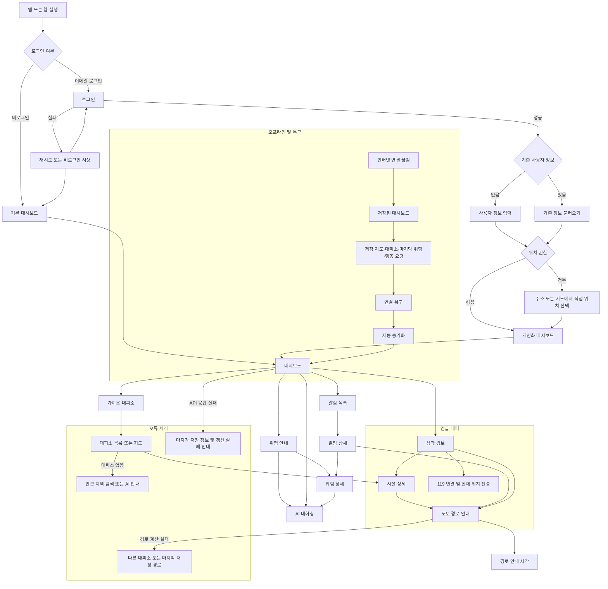

# 구룡포 복합 재난 대응 서비스 UX 기획

## 1. 서비스 목표와 사용자

구룡포의 호우, 침수, 산사태, 강풍, 태풍 위험을 한 화면에서 이해하고, 이용자가 안전한 대피소와 **도보 대피 경로**, 행동 요령, AI 안내를 즉시 받을 수 있게 한다. 위험 단계는 안전, 주의, 경계, 심각의 4단계다. 심각 단계에서는 `즉시 대피`, `안전 경로`, `119 연결`을 모든 화면의 최우선 행동으로 고정한다.

| 사용자 | 핵심 목적 | 개인화 범위 |
|---|---|---|
| 관광객 | 낯선 지역에서 현재 위험, 가까운 대피소, 즉시 행동을 빠르게 확인 | 현재 위치, 언어, 접근성, 이동수단 |
| 주민 | 집·직장·자주 가는 장소의 위험과 재난 후 지원까지 지속 관리 | 등록 장소, 알림, 연령·건강·동반자, 자주 쓰는 대피소 |
| 비로그인 사용자 | 현재 위치 기반 기본 안전 정보와 대피 | 저장·동기화·개인화 제외 |

## 2. 화면 목록과 화면별 구성

`갱신 표시`는 온라인 상태·마지막 갱신 시각·저장 정보 여부를 상단 상태 영역에 일관되게 노출하는 것을 뜻한다.

| 화면 | 목적·주요 사용자 | 표시 정보 | 주요 버튼 및 위치 | 선택 결과 | 온라인 / 오프라인 | 갱신 표시 |
|---|---|---|---|---|---|---|
| 시작 및 로그인 | 진입, 공통 | 로그인·비로그인 안내 | 중앙 `로그인`, `둘러보기` | 로그인 또는 기본 대시보드 | 온라인 로그인 / 오프라인은 저장된 사용자만 둘러보기 | 로그인 연결 상태 |
| 이메일 회원가입 | 계정 생성, 공통 | 이메일, 비밀번호, 약관 | 하단 `가입`, 상단 뒤로가기 | 사용자 정보 입력 | 온라인만 가입 가능 / 오프라인은 저장 후 재시도 | 오류 메시지 |
| 로그인 실패 | 인증 오류 회복, 공통 | 실패 이유, 비로그인 안내 | `재시도`, `둘러보기` | 로그인 재시도 또는 기본 대시보드 | 온라인 인증 / 오프라인 인증 불가 | 연결 상태 |
| 사용자 정보 | 개인화 시작, 주민 중심 | 역할, 연령대, 이동수단, 건강·동반자 선택 | 하단 `저장 후 계속` | 위치 권한 또는 대시보드 | 서버 저장 / 마지막 저장값 편집 가능 | 동기화 시각 |
| 위치 권한·직접 선택 | 정확한 위험 판단, 공통 | 권한 이유, 주소 검색, 지도 핀 | `허용`, `직접 선택` | 위치 기반 대시보드 | GPS·지도 최신 / 저장 지도에서 주소·핀 선택 | 위치 정확도·저장 시각 |
| 대시보드 | 현재 상황 판단, 공통 | 위험 단계, 지도, 가까운 대피소, 행동 요령, 알림 | 상단 알림, 지도 위 `대피소`, 하단 `AI` | 상세·목록·AI | 실시간 위험 / 저장 위험·지도·요령 | 항상 표시 |
| 위험 상세 | 위험 원인과 행동 이해, 공통 | 재난 유형, 영향 지역, 특보, 행동 요령 | 상단 `대피소 보기`, `AI에게 묻기` | 목록 또는 AI | 최신 관측 / 마지막 위험 정보 | 자료 시각·오래됨 경고 |
| AI 대화 | 맞춤 질문·음성 안내, 공통 | 대화, 현재 위험 요약, 출처 시각 | 하단 입력·마이크, `경로 보기` | 답변·대피 경로 | 실시간 질의 / 저장 행동요령과 제한 응답 | 답변 근거·갱신 시각 |
| 대피소 목록 | 후보 비교, 공통 | 안전 추천, 거리, 도보 시간, 운영 상태, 수용 가능 여부 | 정렬 `안전 추천/가까운`, 항목 선택 | 시설 상세 | 실시간 운영 / 저장 위치·운영 정보 | 목록 갱신 시각 |
| 대피소 시설 상세 | 대피 결정을 지원, 공통 | 명칭, 거리, 시간, 수용·운영, 접근성, 연락처 | 하단 `안전 경로 안내`, `전화` | 경로 또는 전화 | 최신 운영 / 저장 정보와 오래됨 경고 | 갱신 시각 |
| 도보 경로 안내 | 실시간 대피, 공통 | 현재 위치, 목적지, 다음 방향, 남은 거리·시간, 위험 구간 | `재탐색`, `안내 종료`, 심각 시 `119` | 경로 갱신·종료 | 최신 위험 회피 / 마지막 저장 경로를 보조로 표시 | 경로 계산·지도 시각 |
| 알림 목록 | 놓친 경고 확인, 공통 | 읽음 여부, 단계, 장소, 발송 시각 | 항목 선택 | 알림 상세 | 푸시·서버 동기화 / 저장 알림 | 마지막 동기화 |
| 알림 상세 | 경고에서 행동으로 전환, 공통 | 재난 설명, 영향 장소, 행동·대피 버튼 | `위험 상세`, `대피소/경로` | 상세 또는 경로 | 최신 내용 / 저장 내용과 경고 | 발송·갱신 시각 |
| 등록 장소 관리 | 주민 생활권 관리, 주민 | 집·직장·자주 가는 장소와 위험 상태 | `추가`, 항목 `수정/삭제` | 장소 편집 | 서버 동기화 / 로컬 변경 대기 | 동기화 상태 |
| 알림 설정 | 필요한 경고만 수신, 주민 | 재난 유형, 등록 장소, 푸시 수신 | `저장` | 이전 화면 | 서버 저장 / 로컬 초안 | 저장·동기화 상태 |
| 접근성·언어 | 누구나 이용, 공통 | 한국어/English, 큰 글씨, 고대비, 음성 | 토글·선택 후 `적용` | 현재 화면에 반영 | 기기·서버 설정 / 기기 설정 유지 | 적용 상태 |
| 오프라인·오래된 정보 | 제한을 명확히 알림, 공통 | `저장된 정보` 배지, 마지막 갱신, 사용 가능 범위 | `다시 연결 시도` | 동기화 대기 | 저장 지도·대피소·위험·요령 | 강제 표시 |
| 데이터 갱신 실패 | API 실패의 안전한 대체, 공통 | 실패 데이터, 마지막 정상 값, 시각 | `재시도`, `AI 도움` | 재시도·AI | 마지막 정상 데이터만 표시 | 실패 원인·시각 |
| 대피소 없음·경로 실패 | 대체 행동 제시, 공통 | 사유, 인근 지역·마지막 저장 경로 | `다른 대피소`, `AI 도움`, 심각 시 `119` | 목록·AI·긴급전화 | 최신 탐색 실패 / 저장 경로 보조 | 실패 시각 |

## 3. 관광객·주민 대시보드 비교

| 영역 | 관광객 | 주민 | 공통 |
|---|---|---|---|
| 첫 정보 | 현재 위치 주변 위험도와 즉시 행동 | 현재 위치 + 집·직장·자주 가는 장소의 위험 | 상단 위험 단계와 온라인·오프라인 상태 |
| 지도 | 주변 위험 지역, 대피소, 현재 위치 중심 | 등록 장소의 상태와 영향 예상까지 표시 | 위험 레이어, 대피소, 지도 확대·직접 선택 |
| 대피 | 가장 안전한 대피소와 도보 경로를 크게 제시 | 자주 이용하는 대피소와 장소별 대피 경로 | `가까운 대피소`·안전 추천 정렬 |
| 안내 | 한국어/영어, 접근성, 간단한 행동 요령 | 개인화 행동 요령, 알림, 재난 후 지원 | AI 대화·알림 버튼 |
| 안전 단계별 우선 행동 | 주의: 위험 지도, 경계: 대피소, 심각: 즉시 대피 | 주의: 등록 장소 확인, 경계: 장소별 경로, 심각: 즉시 대피·119 | 위험 색상 외 텍스트·아이콘·음성으로 단계 전달 |

## 4. 데이터 API와 화면 활용

| 데이터·기관 | 제공 항목 | 사용하는 화면·사용자 표시 | 위험도·경로 역할 | 연결 / 오프라인 / 실패 대체 |
|---|---|---|---|---|
| 포항 디지털 트윈 API | 실시간 수위, 풍속, 맨홀, 미세먼지, 자외선 | 대시보드 지도·카드, 위험 상세, AI | 침수·강풍 판단; 맨홀 회피 | 실시간 필요 / 마지막 값·맨홀 저장 / `마지막 수신값` |
| 기상청 API | 강수량, 풍향, 파고, 특보, 단기·중기 예보, 지상관측 | 대시보드, 위험 상세, AI, 알림 | 호우·강풍·태풍 판단; 경로 위험 가중 | 실시간 필요 / 마지막 특보·예보 저장 / `기상 갱신 실패` |
| 재난안전24 | 재난문자, 태풍 영향 정보 | 알림 목록·상세, 위험 상세, AI | 지역 경보 우선도와 행동 요령 | 실시간 필요 / 최근 메시지 저장 / 최근 메시지만 표시 |
| 생활안전지도 | 대피소, 의료시설 위치 | 지도, 목록, 시설 상세, 경로 | 대피 목적지·긴급 시설 후보 | 주기 동기화 / 구룡포 대피소·시설 저장 / 저장 시설 정보 |
| 공공데이터포털 | 산사태 위험 지역 | 지도, 위험 상세, AI, 경로 | 산사태 경고·우회 영역 | 주기 동기화 / 위험 폴리곤 저장 / 마지막 위험 구역 |
| 도로 통제·위험 구간 | 통제 도로, 침수 구간, 현장 신고 | 지도, 경로, 알림 | 통제·위험 구간 회피 | 실시간 필요 / 마지막 상태 저장 / 오래된 도로 정보 경고 |
| 국토지리정보원 DEM | 고도, 경사도 | 경로 상세, AI | 급경사·오르막 회피, 이동제약 가중 | 기준 데이터 / 구룡포 경사도 저장 / 기본 안전 경로 |
| OpenStreetMap·GraphHopper | 도로망, 보행 경로 | 지도, 경로 안내 | 도보 경로 계산·재탐색 | 실시간 경로 계산 / 마지막 경로 저장 / 다른 대피소 선택 |
| 포항시 재난안전 정보 | 행동 요령, 복구·보험·지원, 긴급연락 | 위험 상세, AI, 주민 대시보드 | 단계별 행동과 사후 지원 연결 | 주기 동기화 / 행동 요령 저장 / 저장 요령·시각 표시 |
| 대기환경 기준·기상청 UV 기준 | 미세먼지·자외선 단계 및 행동 | 대시보드 생활안전, AI | 일상 안전 단계 산정 | 실시간 필요 / 마지막 수치 저장 / 마지막 측정값 |

## 5. 화면 흐름도

화살표는 화면 이동 또는 상태 변화를 뜻한다. `온라인`과 `오프라인`은 어느 주요 화면에서도 전환될 수 있으며, 오류 노드는 최신 데이터 대신 마지막 저장 정보를 우선 보여준다.



## 6. 모바일 ASCII 와이어프레임

### A. 일반 상태 대시보드

```text
┌──────────────────────────────┐
│ 구룡포 안전  ● 온라인  10:42 │
│ 안전  현재 위험 없음       🔔 │
├──────────────────────────────┤
│ [지도: 내 위치 / 위험 레이어] │
│        ○ 대피소   △ 위험구역  │
├──────────────────────────────┤
│ 가까운 대피소 1.2km  도보 18분│
│ [대피소 보기]                │
│ 생활 안전  미세먼지 보통 UV 높음│
├──────────────────────────────┤
│ 마지막 갱신 10:42             │
│ [AI에게 묻기 🎙]              │
└──────────────────────────────┘
```

### B. 경계·심각 경보 대시보드

```text
┌──────────────────────────────┐
│ 경계  호우·침수 위험   🔔    │
│ 지금 해야 할 일: 안전한 곳 이동│
│ [즉시 대피] [119 연결]        │
├──────────────────────────────┤
│ [지도: 침수 ██ / 맨홀 ● / 내 위치]│
│ 가장 안전한 대피소 0.8km       │
│ [안전 경로 안내]              │
├──────────────────────────────┤
│ 침수 예상 20분 내 · 강수 42mm/h│
│ [행동 요령] [AI 대화]         │
├──────────────────────────────┤
│ 데이터 갱신 10:42 · 온라인    │
└──────────────────────────────┘
```

### C. 오프라인 대시보드

```text
┌──────────────────────────────┐
│ ⚠ 오프라인 · 저장된 정보      │
│ 마지막 갱신 09:58              │
├──────────────────────────────┤
│ [저장된 구룡포 지도]           │
│ [마지막 위험 지역 / 대피소]     │
├──────────────────────────────┤
│ 저장된 행동 요령               │
│ [대피소 목록] [저장 경로 보기] │
│ 최신 정보가 아닐 수 있습니다    │
└──────────────────────────────┘
```

### D. 대피소 목록과 시설 상세

```text
┌──────────────────────────────┐
│ ← 대피소              [지도] │
│ [안전 추천 ▼] [가까운 순]      │
├──────────────────────────────┤
│ 1. 구룡포 실내체육관  0.8km    │
│    도보 12분 · 운영 중 · 여유  │
│    [상세 보기]                 │
│ 2. 구룡포초등학교    1.2km     │
└──────────────────────────────┘

┌──────────────────────────────┐
│ ← 구룡포 실내체육관            │
│ 0.8km · 도보 12분 · 운영 중    │
│ 수용 가능: 여유 / 휠체어 접근 가능│
│ 연락처 054-XXX-XXXX            │
│ [안전 경로 안내]    [전화]     │
└──────────────────────────────┘
```

### E. 도보 경로와 AI 대화

```text
┌──────────────────────────────┐
│ ← 안전 경로          ● 온라인 │
│ 현재 위치 → 구룡포 실내체육관  │
├──────────────────────────────┤
│ [지도: 권장 경로 ━━━]          │
│       [회피: 침수 ██ 맨홀 ●]   │
├──────────────────────────────┤
│ 다음: 80m 앞 좌회전            │
│ 남은 거리 0.6km · 9분          │
│ [경로 재탐색] [안내 종료]      │
└──────────────────────────────┘

┌──────────────────────────────┐
│ ← 구룡포 침수 Agent           │
│ 현재: 경계 · 최신 10:42        │
│ AI: 도보 이동은 권장하지 않습니다│
│ [안전 경로 보기] [행동 요령]   │
│ 메시지 입력...       [🎙] [↑]  │
└──────────────────────────────┘
```

## 7. 웹 ASCII 와이어프레임

### A. 웹 대시보드

```text
┌─────────────────────────────────────────────────────────────────────────────┐
│ 구룡포 안전  | 대시보드 | 대피소 | 알림 | 설정       ● 온라인 · 10:42  [로그인]│
├─────────────────────────────────────────────────────────────────────────────┤
│ [경계] 학교 근처 침수 발생 · 강수량 42mm/h  [즉시 대피] [119 연결]            │
├──────────────────────────────────────┬──────────────────────────────────────┤
│                                      │ 구룡포 침수 Agent                     │
│  지도                                │ 현재 위험: 경계                       │
│  - 위험 레이어 / 맨홀 / 대피소       │ 도보 이동 비권장                      │
│  - 현재 위치 / 안전 경로             │ [안전 경로 보기] [대피소 전화]        │
│                                      ├──────────────────────────────────────┤
│                                      │ 가까운 대피소                         │
│                                      │ 1. 실내체육관 0.8km · 12분 [상세]     │
│                                      ├──────────────────────────────────────┤
│                                      │ 알림 / 행동 요령 / 갱신 시각          │
└──────────────────────────────────────┴──────────────────────────────────────┘
```

### B. 웹 경로 안내

```text
┌─────────────────────────────────────────────────────────────────────────────┐
│ ← 대시보드  안전 경로 안내                  ● 온라인 · 경로 갱신 10:42        │
├──────────────────────────────────────┬──────────────────────────────────────┤
│ [대형 지도: 권장 경로 / 회피 위험]     │ 목적지: 구룡포 실내체육관              │
│                                      │ 남은 거리 0.6km · 예상 9분             │
│                                      │ 다음 이동: 80m 앞 좌회전                │
│                                      │ 위험 구간: 침수 2곳, 맨홀 1곳 회피      │
│                                      │ [재탐색] [다른 대피소] [안내 종료]      │
│                                      │ 심각 시 [119 연결 및 위치 전송]         │
└──────────────────────────────────────┴──────────────────────────────────────┘
```

## 8. 핵심 버튼·행동·결과·다음 화면

| 위치 | 버튼·행동 | 목적 | 결과·다음 화면 |
|---|---|---|---|
| 대시보드 상단 | `즉시 대피` | 심각 상황에서 가장 짧은 행동 경로 제공 | 안전 추천 대피소의 경로 안내 |
| 대시보드 지도·카드 | `대피소 보기` | 주변 후보 비교 | 대피소 목록 또는 지도 |
| 대피소 상세 하단 | `안전 경로 안내` | 선택 시설까지 위험 회피 경로 시작 | 도보 경로 안내 |
| 경로 화면 하단 | `경로 재탐색` | 새 위험·통제 반영 | 최신 경로 재계산, 실패 시 대체 화면 |
| 전 화면 공통 | `AI 대화` | 질문·음성 기반의 개인화 안내 | AI 대화창 |
| 위험·알림 상세 | `행동 요령` | 현재 단계에 맞는 행동 제시 | 위험 상세의 행동 섹션 |
| 심각 경보 상단 | `119 연결` | 긴급 신고와 위치 전달 | 시스템 전화 연결 전 확인 |
| 상태 배너 | `다시 연결 시도` | 오프라인·갱신 실패 복구 | 자동 동기화 후 현재 화면 갱신 |
| 위치 권한 화면 | `직접 선택` | 권한 거부에도 서비스 유지 | 주소 검색·지도 핀 선택 |

## 9. 추가로 결정할 사항

| 질문 | 선택지와 차이 | 추천 |
|---|---|---|
| 심각 단계에서 위치를 119에 어떻게 전달할까? | A. 사용자가 확인 후 전송: 오작동 위험이 낮음. B. 자동 전송: 더 빠르나 동의·법적 검토 필요 | **A** — 긴급 상황에서도 명시적 동의를 유지한다. |
| 비로그인 사용자의 알림 범위는? | A. 앱 실행 중 화면 알림만. B. 위치 기반 푸시까지 제공 | **A** — 계정·동의 없는 장기 위치 처리를 피한다. |
| 대피소 수용 가능 여부의 출처와 갱신 주기는? | A. 기관 수동 갱신: 현실적이나 지연 가능. B. 현장 시스템 연동: 정확하나 연계 난도 높음 | **A로 시작 후 B 확장** — 초기 서비스의 신뢰 기준을 명확히 한다. |
| 경로가 위험해진 뒤의 안내 방식은? | A. 즉시 음성·진동과 자동 재탐색. B. 배너로 재탐색 요청 | **A** — 재난 중 화면 주시 부담을 낮춘다. |
| 영어 외 추가 언어는? | A. 한국어·영어. B. 관광 수요 기반 다국어 확장 | **A** — 우선 핵심 2개 언어와 접근성 품질을 확보한다. |

## 구현 범위 메모

위 설계는 화면과 흐름 중심이다. 서버는 로그인·개인화 설정 동기화, 최신 데이터 수집, 위험도·경로 계산 결과 제공만 맡고, 실제 API 데이터의 제공 범위·갱신 주기·정확도는 각 기관과 연계 전에 검증해야 한다.
